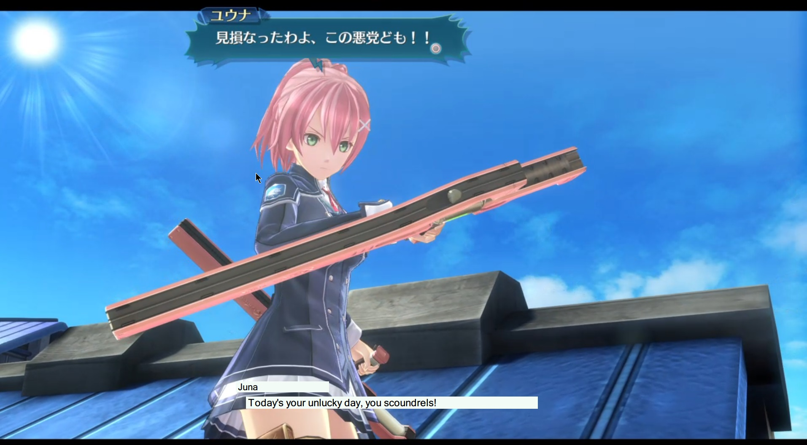
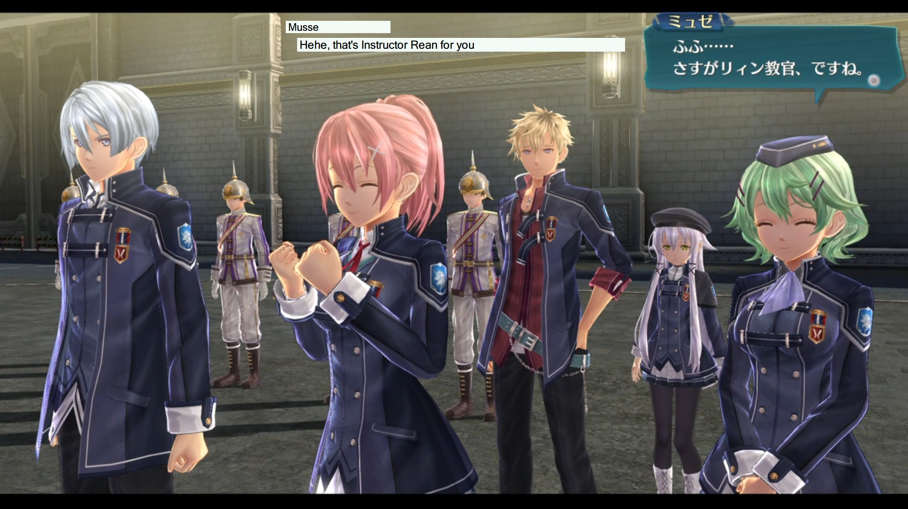
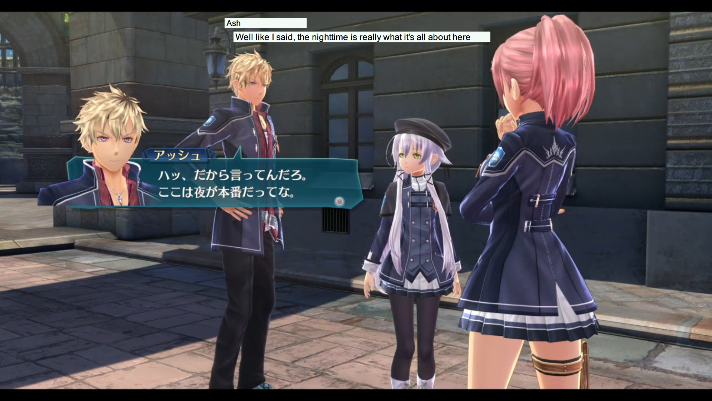
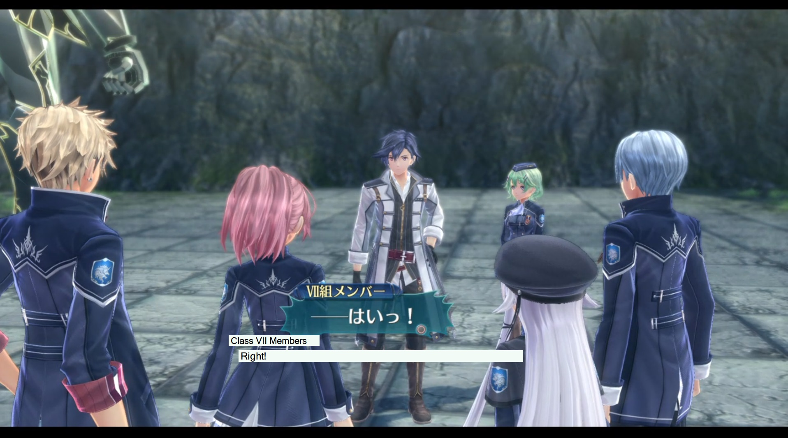

# Cold Translation - Alpha Release

A Windows application for playing Sen no Kiseki III and IV
with the translation spreadsheet by [/u/kitsune547](https://www.reddit.com/user/kitsune547) 
on top of the PS4 Remote Play window.

## Features

- Progress through the translation and the in-game dialog via the controller!
- Load the whole translation and choose your current chapter.
- The last line is always saved, chapter and spreadsheet wise.
- Transparent DialogBox, only the text is shown.
- Blank line in spreadsheet? Blank DialogBox!
- Remembers the location of the DialogBox, so no need to reposition on every start.
- Fast load last selected spreadsheet with the click on a button.

## Controls
#### Keyboard (Program needs focus for these)

- `Arrow Key Right`: Next Line
- `Arrow Key Left`: Previous Line
- `Key End`: Show/Hide all the text
- `Key ESC`: Close the application  
  ( also possible by pressing the `X` in the right corner )

#### Controller (always working)

- `Touch touch button` (__not__ press): Toggles Controller Control Mode on/off  
  A _green ○_ in the right corner means _controller control mode active_,
  a _red ○_ means _inactive_.
  Advancing the dialog via the button mentioned below only works in active controller control mode!  
  ( Unfortunately, a press is also a touch,
  so opening the notebook toggles controller control mode too. 
  This is easily fixed by touching again.
  Another button feasible would be `Share`, but this would block the `Share` completely,
  removing the ability to make screenshots etc.  
  Please give me feedback about that. )
- `DPad Left`: Previous Line (when in Controller Control Mode)
- `DPad Right`: Next Line (when in Controller Control Mode)
- `L3`: Show/Hide all Text (same as R3) (when in Controller Control Mode)
- `R3`: Show/Hide all Text (same as L3) (when in Controller Control Mode)
- `Circle`: Next Line (when in Controller Control Mode)

## Installation

1. Download and extract the latest release [here](https://github.com/goost/coldtranslation/releases/)
    - Make sure, that the downloaded `zip` is unblocked (see FAQ down below)
2. Extract the downloaded release in a folder, the folder should contain the `ColdTranslation.exe`
   along all its dependencies.
    - Further, latest .NET 4.7.2 is required (Win10 may already have installed it itself)
    - For people upgrading from the old plugin version, place the `ColdTranslation.xml`
      , which is in the same folder as the old `ColdTranslation.dll`,
      in the same folder as `ColdTranslation.exe`.
      During the first start the old settings will be automatically imported
3. Start PS4 Remote Play
4. Start `ColdTranslation.exe`
    - You may need to start with Administrator privileges, depending on the UAC settings.
    - First, try without
7. Reposition the DialogBox however you like, it always stays on top all windows
 (by _click_drag_ anywhere in the dialog window, e.g. the labels)
    - The last location is automatically restored on next start
7. Load a translation spreadsheet by fast-loading the last one or picking one via the dialog
    - The spreadsheet must be in `XLSX` format, obtain by downloading from the Google Spreadsheet
8. Choose the worksheet to load
9.  Make sure the DialogBox has focus for the keyboard commands, Controller commands are always working
    - If the DialogBox is invisible, because there is no text to show, `Alt-Tab` to it to gain focus
10. Play the game via controller, progress through dialog via the same `Circle` key after toggling 
    Controller Control Mode via `Touch touch button` when there is a dialog on screen
    - Out-of-sync errors can be corrected by using `DPad Left` and `DPad Right`
    -  `DPad Left` and `DPad Right` are also useful for auto-advancing in-game dialog

## Known Bugs and Limitations

- __This is an alpha release! Although I played Sen VI for a few hours without major problems, things may be broken!__
- The DialogBox window needs focus for the keyboard control to work. This is by design.
- The DialogBox is designed with a resolution of 1920x1080 in mind.
- Due to the structure of the spreadsheet for Sen III, it is not always possible
 to determine the speaker.
 In Sen III speaker mode, the program currently always shows the last _explicitly_ stated name,
 which makes system messages etc. have a speaker name too.
 This is no issue in Sen IV speaker mode, as the Sen IV spreadsheet has the speaker on every line.
- Currently this plugin is written solely for the Sen no Kiseki III and IV translation spreadsheet by [/u/kitsune547](https://www.reddit.com/user/kitsune547).
- Currently, only the _A, B and C_ cells are displayed, _A_ is assumed to contain the speaker,
  _B_ the speech and _C_ further Notes etc.
  Furthermore, the first two rows are assumed not to be speech.
  Most of the time this works out, so far I only saw a few instances where further cells have been used.
  (__The Prologue sheet of the Sen III and Sen IV translation is therefore broken for a few lines,
  just progress manually via `Arrow Key Right` to the first correct line__)
- If there is no blank line in the spreadsheet during a cutscene change,
  the first line of the upcoming cutscene will be spoilered on progression
  (this sounds worse than it actually is during gameplay).
- There is a risk of spoilering the answers to the questions or selecting a false one.
  The plugin is written with a normal pace of play in mind,
  hammering down on the forward button can lead to unexpected results.
- There may be memory leaks.
- It is not possible to quickly skip-read ahead like with the spreadsheet on a separate monitor.
- All kinds of things will break if another `XLSX` file besides the Sen no Kiseki III/IV translation spreadsheet is loaded.
  Or not a spreadsheet at all.

## FAQ

#### Error during start, along the line _Could not load file or assembly 'ColdTranslation[...]' or one of its dependencies. Operation is not supported. (Exception from HRESULT: 0x80131515)_

Windows blocks potentialy harmful files from the internet. After downloading the zip-File it must be _unblocked_.
`Right-Click -> Properties` and then `Unblock` before extracting.
See e.g. [this](https://stackoverflow.com/questions/34400546/could-not-load-file-or-assembly-operation-is-not-supported-exception-from-hres)
question on stackoverflow for more information.  
As long as it is alpha, I do not plan to provide an installer.

## Version

- v1.0.0 - ALPHA: BREAKING - Rewrite of application with Elmish.WPF as standalone
- v0.6.0 - ALPHA: Add shortcut for showing/hiding the taskbar
- v0.5.0 - ALPHA: Add Speaker-Mode selection (no more guessing needed for Sen4)
- v0.4.0 - ALPHA: Add "Hide Extra" shortcut
- v0.3.1 - ALPHA: __BREAKING__ Function of `Arrow Key Up` changed to simulate `Circle` press
- v0.2.0 - ALPHA: Add "Hide All Text" Shortcut
- v0.1.0 - ALPHA: First public release

## Screenshots (minor spoilers in GIF (major for Japanese readers)) - OLD VERSION (but looks basically the same)

Stutterers are due to gif.

## Third Party

Thanks to [PS4RemotePlayInterceptor](https://github.com/komefai/PS4RemotePlayInterceptor/)
by komefai, without it this would have not been possible!

