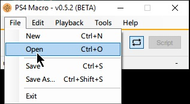
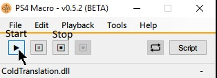

# Cold Translation - Alpha Release

A [PS4Macro](https://github.com/komefai/PS4Macro) plugin (Windows) for playing Sen no Kiseki III and IV
with the translation spreadsheet by [/u/kitsune547](https://www.reddit.com/user/kitsune547).

## Features

- Load the whole translation and choose your current chapter.
- The last line is always saved, chapter and spreadsheet wise.
- Transparent DialogBox, only the text is shown.
- Blank line in spreadsheet? Blank DialogBox!
- Remembers the location of the DialogBox, so no need to reposition on every start.
- Progress through the translation and the in-game dialog via one keyboard press.
- Fast load last selected spreadsheet with the click on a button.

## Controls
- `Arrow Key Down`: Next Line _and_ simulate press of ○ (`Circle`).
- `Arrow Key Right`: Next Line
- `Arrow Key Left`: Previous Line
- `Arrow Key Up`: Simulate press of ○ (`Circle`)
- `Key End`: Show/Hide Speaker Name
- `Key Page Down`: Show/Hide all the text
- `Key Delete`: Show/Hide the extra text

## Installation

1. Download and install/extract [PS4Macro](https://github.com/komefai/PS4Macro)
2. Download the latest release of this plugin from the [tags](https://github.com/goost/coldtranslation/releases/)
   page
1. Extract the downloaded release in a folder, the folder should contain two `dlls`.
3. Start PS4 Remote Play, start PS4Macro
4. Load the script (`ColdTranslation.dll`) via PS4Macro 
    - A ShortCut to PS4Macro with a Target of
      `G:\Path\To\PS4Macro.exe --StartupFile="G:\Path\To\ColdTranslation.dll"`
      Allows the plugin to be loaded directly
5. Click the start button 
6. Reposition the PS4Remote Play window and the DialogBox however you like 
 (by _click_drag_ anywhere __near__, not on, the grey background/label)
    - If the plugin is stopped via the Ps4Macro stop button, the location of the DialogBox window is saved
7. Load a translation spreadsheet by fast-loading the last one or picking one via the dialog
    - The spreadsheet must be in `XLSX` format, obtain by downloading from the Google Spreadsheet
8. Choose the worksheet to load
9.  Make sure the DialogBox has focus
    - Click on the DialogBox (on a label) last to give it focus
    - It needs focus for the keyboard commands to work
    - If the DialogBox is invisible, because there is no text to show, `Alt-Tab` to it to gain focus
10. Play the game via controller, progress through dialog via the arrow keys
    - Progressing through the dialog via the `Arrow Key Down` allows one to progress
      mostly in sync with the game dialog.
    - Out-of-sync errors can be corrected by using the other arrow keys.

## Known Bugs and Limitations

- __This is an alpha release! Although I played Sen III from Ch3 to the End without major problems, things may be broken!__
- The DialogBox window needs focus to work.
- The DialogBox is designed with a resolution of 1920x1080 in mind.
- Due to the structure of the spreadsheet for Sen III, it is not always possible
 to determine the speaker.
 In Sen III speaker mode, the script currently always shows the last _explicitly_ stated name,
 which makes system messages etc. have a speaker name too.
 A little flexibility is made possible via the `Show/Hide Speaker` shortcut.
 This is no issue in Sen IV speaker mode, as the Sen IV spreadsheet has the speaker on every line.
- The location if the DialogBox window is only saved, if one stops the script
 via the _Stop Button_ of PS4Macro (not by closing directly).
 This seems to be a limitation of PS4Macro and/or my current knowledge of C# Desktop development.
 After saving once, the DialogBox is auto repositioned on start to this location.
- Currently this plugin is written solely for the Sen no Kiseki III and IV translation spreadsheet by [/u/kitsune547](https://www.reddit.com/user/kitsune547).
- Currently, only the _A, B and C_ cells are displayed, _A_ is assumed to contain the speaker,
  _B_ the speech and _C_ further Notes etc.
  Furthermore, the first two rows are assumed not  to be speech.
  Most of the time this works out, so far I only saw a few instances where further cells have been used.
  (The Prologue sheet of the Sen III and Sen IV translation is therefore broken for a few lines,
  just progress manually to the first correct line)
- If there is no blank line in the spreadsheet during a cutscene change,
  the first line of the upcoming cutscene will be spoilered on progression
  (this sounds worse than it actually is during gameplay).
- There is a risk of spoilering the answers to the questions or selecting a false one.
  The plugin is written with a normal pace of play in mind,
  hammering down on the forward button can lead to unexpected results.
- Dragging the DialogBox only works when click-and-hold __not__ on one of the labels.
- As the DialogBox needs focus, the TaskBar is still shown.
  The plugin circumvents this by hiding the taskbar on start and re-hiding on exit.
  Force closing the program can lead to an invisible TaskBar!
  (__Troubleshoot:__ Restart the plugin and close correctly.)
- It is not pretty.
- There may be memory leaks.
- It is not possible to quickly skip-read ahead like with the spreadsheet on a separate monitor.
- All kinds of things will break if another `XLSX` file besides the Sen no Kiseki III/IV translation spreadsheet is loaded.
  Or not a spreadsheet at all.

## Version
- v0.5.0 - ALPHA: Add Speaker-Mode selection (no more guessing needed for Sen4)
- v0.4.0 - ALPHA: Add "Hide Extra" shortcut
- v0.3.1 - ALPHA: __BREAKING__ Function of `Arrow Key Up` changed to simulate `Circle` press
- v0.2.0 - ALPHA: Add "Hide All Text" Shortcut
- v0.1.0 - ALPHA: First public release

## Screenshots (minor spoilers in GIF (major for Japanese readers))

Stutterers are due to gif.

